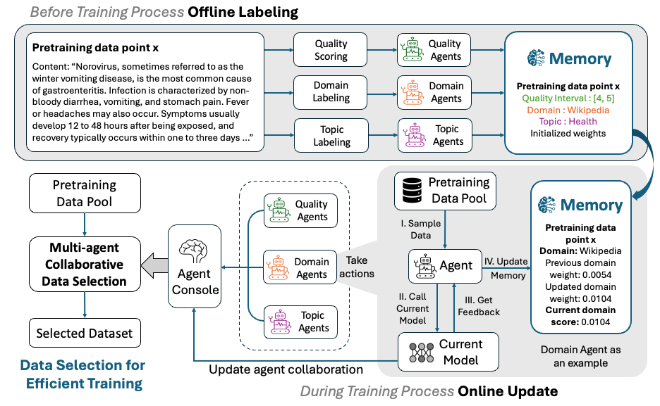

# Multi-Agent Collaborative Data Selection for Efficient LLM Pretraining
This is the repo for the paper [Multi-Agent Collaborative Data Selection for Efficient LLM Pretraining](https://arxiv.org/abs/2410.08102). 
We will release the model checkpoints, datasets and the code within next few weeks. 

## Updates
- **[21 October, 2024]:** We release the [labeled SlimPajama datasets](https://huggingface.co/datasets/beccabai/slimpajama_labeled).
- **[14 October, 2024]:** We release our [1.3B model checkpoints](https://huggingface.co/beccabai/1.3B-multi-agent-collab-checkpoints) and [BERT Topic Classifier](https://huggingface.co/beccabai/bert_topic_model). 

## Release plan
TODOs:
- [x] Model Checkpoints 
- [x] BERT Topic Model Checkpoint 
- [x] Labeled Slimpajama-670B datasets 
- [ ] Code for baselines and methods - will be released after acceptance
- [ ] Summarize data efficient pretraining methods 
......
